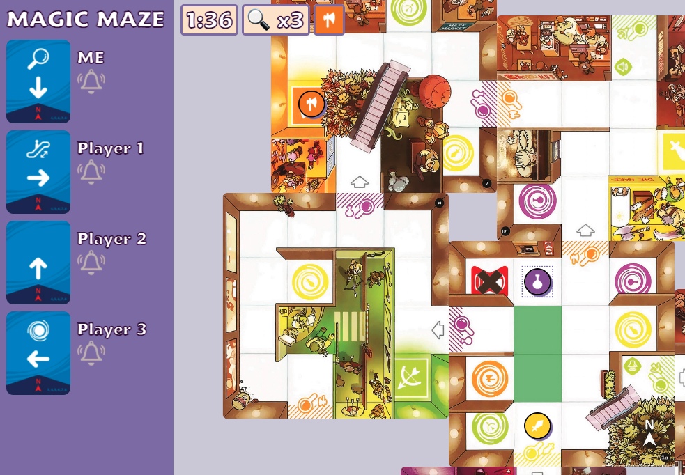

# Magic Maze

An online implementation of the asynchronous cooperative board game [Magic Maze](https://boardgamegeek.com/boardgame/209778/magic-maze). Try it at https://util.in:8100.

The rules are [here](https://sitdown-games.com/wp-content/uploads/2018/09/MM_Rules_EN_HR_Sept2018_LD.pdf).

## Quickstart

This game is developed with Node 16.0.0 and Yarn 1.22.10.

Run:

    yarn install
    yarn build
    yarn server

Then go to http://localhost:9100.

## Development

- First run `yarn install` and `yarn build` once.
- To run a game client-side only, run `yarn start`. To run with the server, run `yarn server` and `yarn client` in two different consoles.
- Go to http://localhost:3000.

## Credits

- [Shanky Panky's TTS mod](https://steamcommunity.com/sharedfiles/filedetails/?id=1113582696) for image assets
- [陽菜/Hina & Chosic](https://www.chosic.com/free-music/all/?keyword=%E9%99%BD%E8%8F%9C/Hina&artist) for background music
- [ashugeo](https://github.com/ashugeo/magic-maze) for design inspiration
- [Fonts Geek](https://fontsgeek.com/fonts/Maiandra-Black-Regular) for the Maiandra font
- [boardgame.io](https://boardgame.io/), a very convenient framework for producing online multiplayer games
- [React Easy Panzoom](https://www.npmjs.com/package/react-easy-panzoom) for an easy-to-use panzoom library

